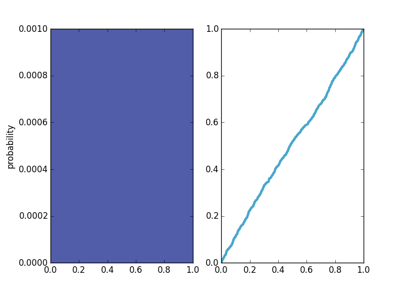

[Think Stats Chapter 4 Exercise 2](http://greenteapress.com/thinkstats2/html/thinkstats2005.html#toc41) (a random distribution)

>>    
The random function did a pretty good job because the cumulative density is approximately a straight line. I guess some peudo random number generator may do a better job.

