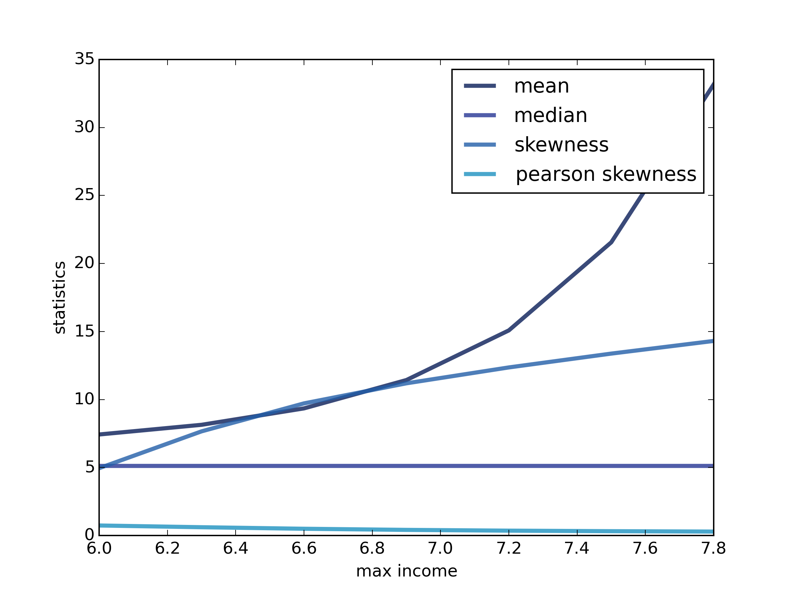

[Think Stats Chapter 6 Exercise 1](http://greenteapress.com/thinkstats2/html/thinkstats2007.html#toc60) (household income)

>> mean:  74278.7075312   
median:  51226.4544789   
skewness:  4.94992024443   
pearson skewness:  0.736125801914   
fraction below mean:  0.660005879567   
   
As shown in the above graph, mean increases exponetially with the log10 based upper bound. Skewness increases linearly, median stays flat and Pearson skewness shows a slight decrease. The evidence suggests that median and Pearson skewness are robust to outliers but mean and skewness are vulnerable.   
   
    import hinc2
    import hinc
    import numpy as np
    import thinkstats2
    import thinkplot
    
    def gen_stats(df, log_upper=6.0):
        log_sample = hinc2.InterpolateSample(df, log_upper=log_upper)
    
        sample = [10 ** x for x in log_sample]
        mean = np.array(sample).mean()
        median = thinkstats2.Median(sample)
        skewness = thinkstats2.StandardizedMoment(sample, 3)
        p_skewness = thinkstats2.PearsonMedianSkewness(sample)
        cdf = thinkstats2.Cdf(sample)
    
        return mean, median, skewness, p_skewness, cdf[mean]
    
    data = hinc.ReadData()
    mean, median, skewness, p_skewness, cdf_mean = gen_stats(data)
    print('mean: ', mean)
    print('median: ', median)
    print('skewness: ', skewness)
    print('pearson skewness: ', p_skewness)
    print('fraction below mean: ', cdf_mean)
    
    ubs = np.arange(6, 8.1, 0.3)
    stats = []
    for ub in ubs:
        stats.append(gen_stats(data, log_upper=ub))
    
    mean_arr, median_arr, skewness_arr, p_skewness_arr, _ = zip(*stats)
    mean_arr = [x/1e4 for x in mean_arr]
    median_arr = [x/1e4 for x in median_arr]
    labels = ['mean', 'median', 'skewness', 'pearson skewness']
    for k, s in enumerate([mean_arr, median_arr, skewness_arr, p_skewness_arr]):
        thinkplot.Plot(ubs, s, label=labels[k])
    thinkplot.Save(root='stat_upper', formats=['png'], xlabel='max income', ylabel='statistics')

