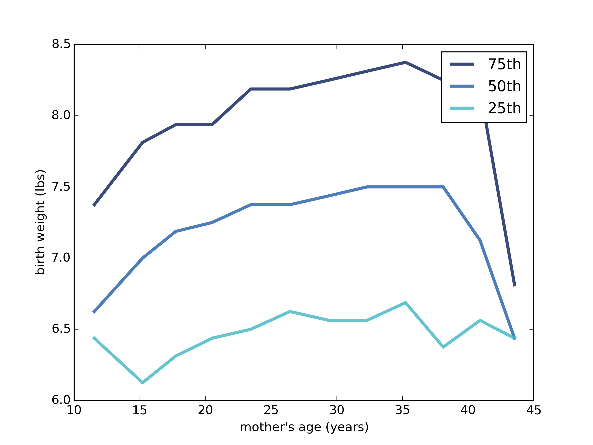

[Think Stats Chapter 7 Exercise 1](http://greenteapress.com/thinkstats2/html/thinkstats2008.html#toc70) (weight vs. age)

>> As show in the graph below, birth weights and mother's age have a positive correlation when age is between 15 to 35, and a negative correlation for age 35+.   
   
```
Pearson Correlation is 0.069
Spearman Correlation is 0.095   
```   
    import nsfg
    import thinkstats2
    import numpy as np
    import thinkplot
    
    preg = nsfg.ReadFemPreg()
    nsfg.CleanFemPreg(preg)
    
    live = preg[preg.outcome == 1]
    live['page'] = live.agepreg * 100
    
    live = live.dropna(subset=['page', 'totalwgt_lb'])
    age_bins = np.arange(live.page.min()//1, live.page.max()//1 + 2, 3)
    indices = np.digitize(live.page, age_bins)
    groups = live.groupby(indices)
    
    ages = [group.page.mean() for i, group in groups]
    cdfs = [thinkstats2.Cdf(group.totalwgt_lb) for i, group in groups]
    
    thinkplot.PrePlot(3)
    for percent in [75, 50, 25]:
        weights = [cdf.Percentile(percent) for cdf in cdfs]
        label = '%dth' % percent
        thinkplot.Plot(ages, weights, label=label)
    thinkplot.Save(root='scatter',
                   formats=['png'],
                   xlabel='mother\'s age (years)',
                   ylabel='birth weight (lbs)')
    
    print('Pearson Correlation is %5.3f' % thinkstats2.Corr(live.page, live.totalwgt_lb))
    print('Spearman Correlation is %5.3f' % thinkstats2.SpearmanCorr(live.page, live.totalwgt_lb))
