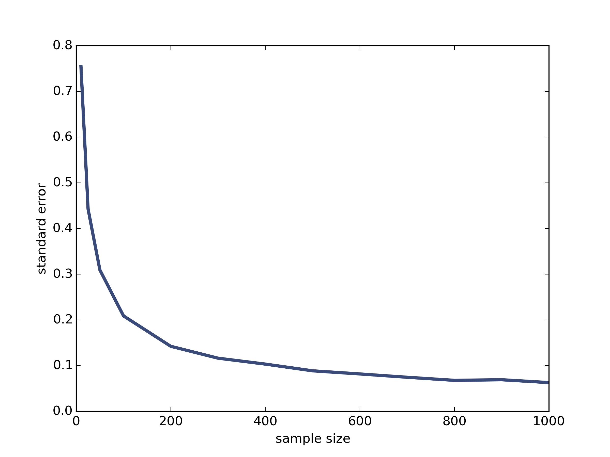

[Think Stats Chapter 8 Exercise 2](http://greenteapress.com/thinkstats2/html/thinkstats2009.html#toc77) (scoring)

>> standard error 0.8098968521152573   
90% confidence interval 1.335330535 3.70300407121   
   
As show below, standard error decreases as the sample size increases.   

