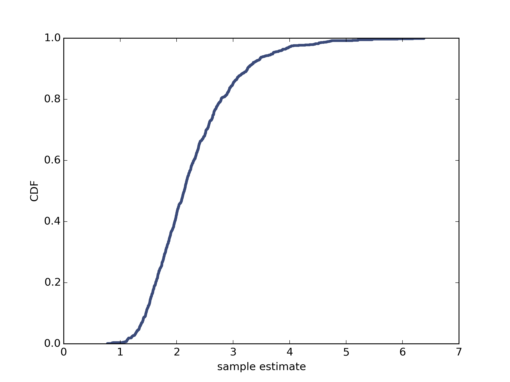

[Think Stats Chapter 8 Exercise 2](http://greenteapress.com/thinkstats2/html/thinkstats2009.html#toc77) (scoring)

>> standard error 0.8098968521152573   
90% confidence interval 1.335330535 3.70300407121   
   
As show below, standard error decreases as the sample size increases.   
   
    import thinkplot
    import thinkstats2
    import numpy as np
    from estimation import RMSE
    
    
    def random_sample(n=10, lam=2, m=1000):
        Ls = []
        for _ in range(m):
            sample = np.random.exponential(1.0/lam, n)
            Ls.append(1 / np.mean(sample))
        se = RMSE(Ls, lam)
        # cdf = thinkstats2.Cdf(Ls)
        # thinkplot.Cdf(cdf)
        # thinkplot.Save(root='cdf', formats=['png'], xlabel='sample estimate', ylabel='CDF')
        # print('standard error', se)
        # print('90% confidence interval', cdf.Percentile(5), cdf.Percentile(95))
        return se
    
    # _ = random_sample()
    
    ses = []
    ns = [10, 25, 50] + list(range(100, 1001, 100))
    for n_sample in ns:
        ses.append(random_sample(n=n_sample))
    thinkplot.Plot(ns, ses)
    thinkplot.Save(root='se_n', formats=['png'], xlabel='sample size', ylabel='standard error')
    

