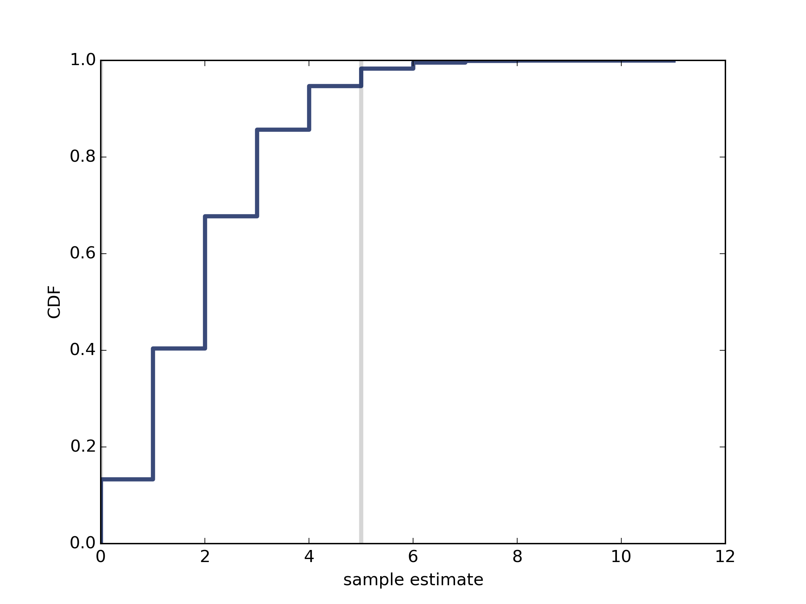
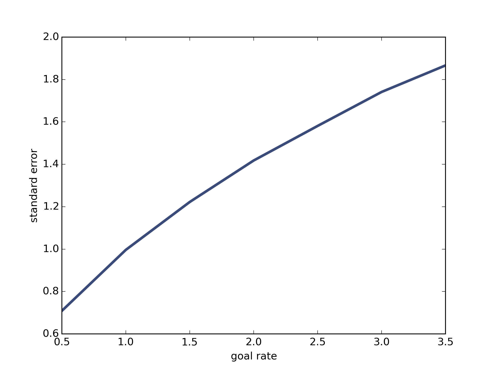

[Think Stats Chapter 8 Exercise 3](http://greenteapress.com/thinkstats2/html/thinkstats2009.html#toc77)

---

>> standard error 1.41038292672593   
mean error 0.00132   
It appears to be an unbiased estimate since the mean error is very small.   
   
As shown in the above, the 90% confidence interval is between 0 and 5.   
   
As illustrated in the above graph, sampling error increases almost linearly with the goal rate.   
    import thinkplot
    import thinkstats2
    import numpy as np
    from estimation import RMSE, MeanError
    
    
    def random_sample(lam=2, m=100000):
        Ls = []
        for _ in range(m):
            total_time = 0
            goals = 0
            while True:
                sample = np.random.exponential(1.0/lam, 1)
                total_time += sample
    
                if total_time > 1:
                    break
                goals += 1
            Ls.append(goals)
    
        se = RMSE(Ls, lam)
        me = MeanError(Ls, lam)
    
        cdf = thinkstats2.Cdf(Ls)
        low = cdf.Percentile(5)
        hi = cdf.Percentile(95)
    
        thinkplot.Plot([low, low], [0, 1], color='0.8', linewidth=3)
        thinkplot.Plot([hi, hi], [0, 1], color='0.8', linewidth=3)
        thinkplot.Cdf(cdf)
        thinkplot.Save(root='soccer_cdf', formats=['png'], xlabel='sample estimate', ylabel='CDF')
        print('standard error', se)
        print('mean error', me)
        return se
    
    _ = random_sample()
    
    # ses = []
    # lams = np.arange(0.5, 4, 0.5)
    # for lam in lams:
    #     ses.append(random_sample(lam=lam))
    # thinkplot.Plot(lams, ses)
    # thinkplot.Save(root='lam_n', formats=['png'], xlabel='goal rate', ylabel='standard error')

---