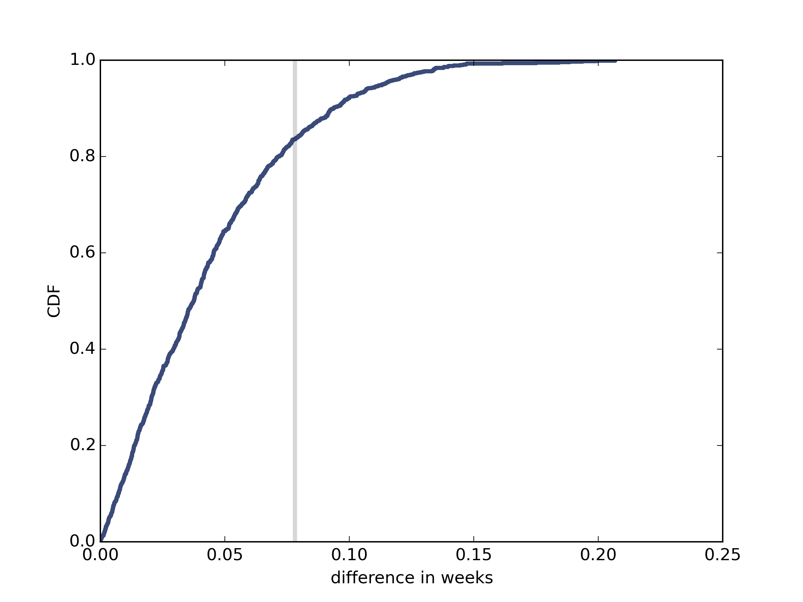

[Think Stats Chapter 9 Exercise 2](http://greenteapress.com/thinkstats2/html/thinkstats2010.html#toc90) (resampling)

>> pvalue for pregnancy length: 0.164   
pvalue for birth weight: 0.0  
These pvalues are very close to those under the permutation model. So using resampling does not appear to have a significant effect on the results.  
   
The CDF graph also looks similar.   
    
    import hypothesis
    import first
    import thinkplot
    
    
    class DiffMeansResample(hypothesis.DiffMeansPermute):
        def RunModel(self):
            return thinkstats2.Resample(self.pool, n=self.n), thinkstats2.Resample(self.pool, n=self.m)
    
    live, firsts, others = first.MakeFrames()
    data = firsts.prglngth.values, others.prglngth.values
    ht = DiffMeansResample(data)
    print('pvalue for pregnancy length:', ht.PValue())
    
    ht.PlotCdf()
    thinkplot.Save(root='resample', formats=['png'], xlabel='difference in weeks', ylabel='CDF')
    
    data = firsts.totalwgt_lb.dropna().values, others.totalwgt_lb.dropna().values
    ht = DiffMeansResample(data)
    print('pvalue for birth weight:', ht.PValue())

